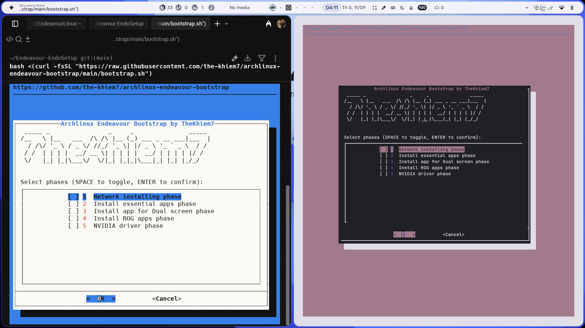

     _             _     _ _                          
    / \   _ __ ___| |__ | (_)_ __  _   ___  __        
   / _ \ | '__/ __| '_ \| | | '_ \| | | \ \/ /        
  / ___ \| | | (__| | | | | | | | | |_| |>  <         
 /_/___\_\_|  \___|_| |_|_|_|_| |_|\__,_/_/\_\        
 | ____|_ __   __| | ___  __ ___   _____  _   _ _ __  
 |  _| | '_ \ / _` |/ _ \/ _` \ \ / / _ \| | | | '__| 
 | |___| | | | (_| |  __/ (_| |\ V / (_) | |_| | |    
 |_____|_| |_|\__,_|\___|\__,_| \_/ \___/ \__,_|_|    
  ____              _       _                         
 | __ )  ___   ___ | |_ ___| |_ _ __ __ _ _ __        
 |  _ \ / _ \ / _ \| __/ __| __| '__/ _` | '_ \       
 | |_) | (_) | (_) | |_\__ \ |_| | | (_| | |_) |      
 |____/ \___/ \___/ \__|___/\__|_|  \__,_| .__/       
                                         |_|             

Smart bootstrap script for setting up EndeavourOS / Arch Linux environment with optional TUI phases.

---


## 🚀 Recommended method

Run this one line and follow the prompts:

```bash
bash -c 't=$(mktemp) && wget -qO "$t" https://raw.githubusercontent.com/the-khiem7/archlinux-endeavour-bootstrap/main/bootstrap.sh && bash "$t" && rm -f "$t"'
````

The above will download the bootstrap script and clone the repo into:

~/.cache/archlinux-endeavour-bootstrap

To make that somewhere else, specify a path as another argument:

```bash
bash bootstrap.sh /path/to/anywhere
```

---

## 💡 Alternative method

If you prefer to clone manually:

```bash
cd ~/Downloads   # or wherever you want
git clone https://github.com/the-khiem7/archlinux-endeavour-bootstrap
cd archlinux-endeavour-bootstrap
./bootstrap.sh
```

---

## 📦 What this does

* Verifies Arch/Endeavour environment (`pacman` required).
* Ensures minimal tooling (`curl`/`wget`, `git`, etc).
* Provides a TUI (via `dialog`) to pick which phases to install:

  * Network tools
  * Essential apps
  * Dual-screen setup
  * ROG utilities
  * NVIDIA driver
* All phases are modular scripts under `setup/`.

---

## ✍️ Notes

* If `dialog` is not installed, the script will ask if you want to install it. Otherwise it falls back to a simple text menu.
* If the cache dir already exists but is not a git repo, it will be cleaned automatically.
* Your signature ASCII art **TheKhiem7** is shown at the top of the TUI menu 😎.